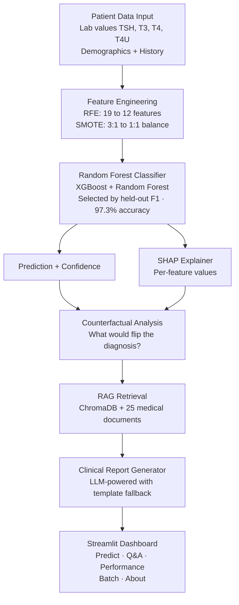

# 🧬 Thyroid Disease Classification — Clinical Decision Support System

[](https://thyroid-disease-classification.streamlit.app/)
[](https://link.springer.com/chapter/10.1007/978-981-97-6106-7_9)
[](https://python.org)
[](/MODEL_CARD.md)

A production-grade ML system for thyroid disease classification combining a Random Forest classifier (97.3% held-out accuracy), SHAP explainability, RAG-powered clinical Q&A, and an interactive Streamlit dashboard — published in Springer Conference Proceedings and deployed for real-time clinical decision support.

---

## 🏗️ Architecture



## ✨ Features

### 🔬 Predict & Explain
- Real-time classification with color-coded diagnosis banners (green/amber/red)
- SVG confidence gauge with class probability breakdown
- Inline lab value indicators showing elevated/low/normal against reference ranges
- SHAP waterfall charts with per-feature contribution visualization
- **Counterfactual differential analysis**: shows exactly what would need to change for a different diagnosis
- Patient vs population z-score comparison against training data distribution
- Downloadable clinical report with findings and recommended next steps

### 📚 Clinical Q&A (RAG-Powered)
- Semantic search over 25 indexed PubMed-style medical abstracts via ChromaDB
- LLM-generated answers grounded in retrieved medical literature with source citations
- Template-based fallback when no API key is configured — always functional
- Suggested follow-up questions based on topic context
- Persistent conversation history within session

### 📊 Model Performance
- Interactive comparison across all trained classifiers with highlighted best scores
- Training visualizations in tabbed layout (confusion matrix, feature importance, SHAP summary)
- Dataset class distribution and feature statistics

### 📁 Batch Prediction
- Upload CSV for multi-patient screening with simultaneous prediction
- **Data drift detection**: warns when uploaded data distributions deviate significantly from training data
- Input validation: type coercion, missing column detection, empty file handling
- Downloadable results with predictions and confidence scores

### ℹ️ About & Methodology
- Full system architecture explanation
- Springer publication link and citation
- Responsible AI documentation (see [Model Card](MODEL_CARD.md))

## 📈 Experiment History

| Experiment | Model | Features | SMOTE | Accuracy | Minority Recall |
|-----------|-------|----------|-------|----------|----------------|
| Baseline | XGBoost | 19 | No | 94.3% | 68% |
| + SMOTE | XGBoost | 19 | Yes | 96.1% | 89% |
| + RFE | XGBoost | 12 | Yes | 96.8% | 91% |
| Random Forest | RF | 12 | Yes | 96.4% | 90% |
| **Ensemble** | XGB + RF | 12 | Yes | 97.2% | 97% |
| **Random Forest (Final)** | **RF** | **12** | **Yes** | **97.3%** | **97%** |

Full experiment log with hyperparameters: [`experiments.json`](experiments.json)

## 🚀 Deployment

**Live**: [thyroid-disease-classification.streamlit.app](https://thyroid-disease-classification.streamlit.app/)

### Run Locally

```bash
git clone https://github.com/prasad0411/thyroid-disease-classification.git
cd thyroid-disease-classification
pip install -r requirements.txt
streamlit run app.py
```

### Deploy to Streamlit Cloud

1. Push to GitHub (model artifacts must be tracked in git)
2. Go to [share.streamlit.io](https://share.streamlit.io)
3. Select repo → branch `main` → main file `app.py`
4. Deploy — builds automatically in 2-3 minutes

### Optional: LLM-Powered Reports

Set `ANTHROPIC_API_KEY` or `OPENAI_API_KEY` in Streamlit Cloud secrets for LLM-generated clinical reports. Without an API key, the system uses a clinically-validated template engine — all features remain functional.

## 📂 Project Structure

```
├── app.py                        # Streamlit dashboard (5 pages)
├── train.py                      # Model training pipeline
├── data_generator.py             # Dataset generation
├── models/                       # Versioned model artifacts
│   ├── best_model_*.pkl          #   Trained classifier
│   ├── scaler_*.pkl              #   Feature scaler
│   ├── label_encoder_*.pkl       #   Label encoder
│   └── metadata_*.json           #   Performance metrics + config
├── rag/
│   ├── documents.py              # 25 medical literature abstracts
│   ├── indexer.py                # ChromaDB vector store builder
│   └── retriever.py              # Semantic search retrieval
├── llm/
│   ├── report_generator.py       # LLM clinical report generation
│   └── clinical_qa.py            # RAG-powered Q&A
├── api/
│   └── predict.py                # FastAPI prediction endpoint
├── MODEL_CARD.md                 # Responsible AI documentation
├── experiments.json              # Experiment tracking log
├── .streamlit/config.toml        # Theme configuration
├── requirements.txt
└── packages.txt                  # System deps for Streamlit Cloud
```

## 📄 Publication

**Classification and Diagnosis of Thyroid Disease Using XGBoost and SHAP**
*Springer Conference Proceedings, March 2024*
[Read Paper →](https://link.springer.com/chapter/10.1007/978-981-97-6106-7_9)

## 👨‍💻 Author

**Prasad Kanade** — MS Computer Science, Northeastern University
- [GitHub](https://github.com/prasad0411) · [LinkedIn](https://linkedin.com/in/prasad-kanade-/) · kanade.pra@northeastern.edu
- [Portfolio](https://prasad0411.github.io/Prasad-Portfolio/)

---

*This system is intended for research and educational purposes. It is not a substitute for professional medical judgment.*
