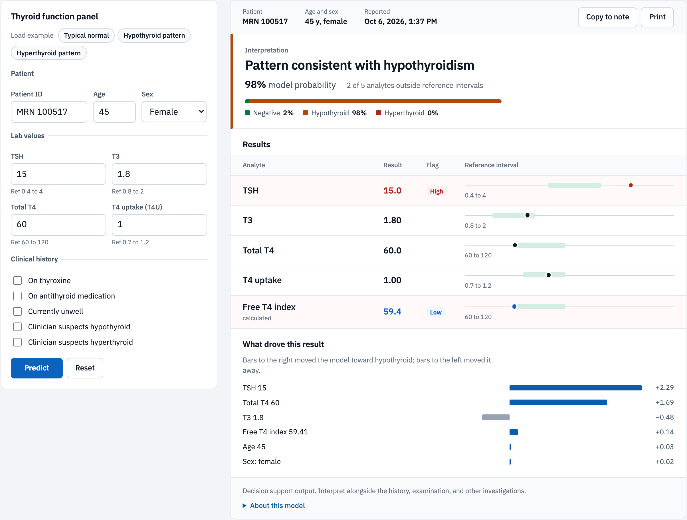
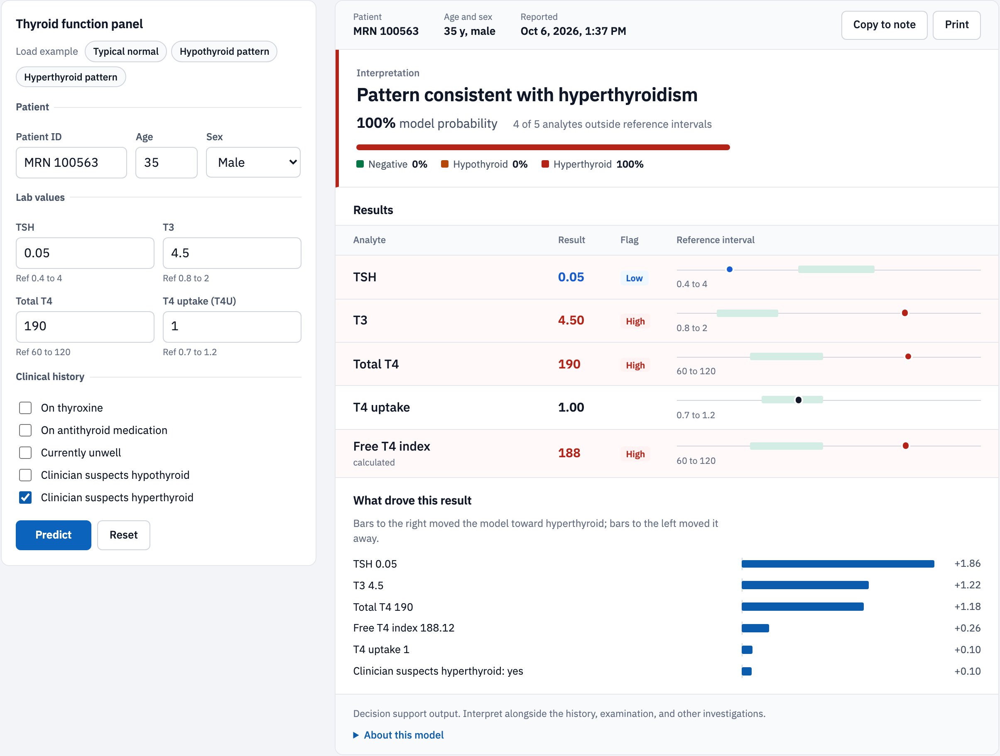
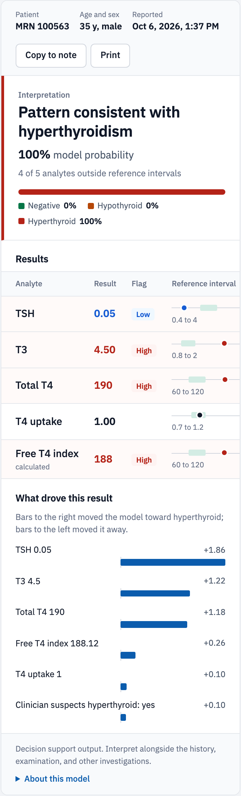
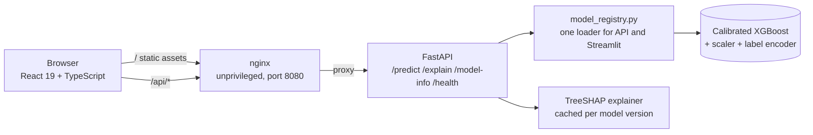

# Thyroid Panel Review

[](https://github.com/prasad0411/thyroid-disease-classification/actions/workflows/frontend.yml)
[](https://github.com/prasad0411/thyroid-disease-classification/actions/workflows/ci.yml)
[](https://prasad0411.github.io/thyroid-disease-classification/)
[](https://link.springer.com/chapter/10.1007/978-981-97-6106-7_9)

Clinical decision support for thyroid function panels. A clinician enters TSH, T3, total T4, and T4 uptake with brief history; the app classifies the panel as negative, hypothyroid, or hyperthyroid, plots every analyte against its reference interval, and explains each prediction with SHAP so the reasoning is visible, not just the answer.



<details>
<summary>Hyperthyroid report and mobile view</summary>



</details>

**Live app:** https://prasad0411.github.io/thyroid-disease-classification/  
Frontend on GitHub Pages, API on Google Cloud Run. The original Streamlit interface is still available as the [Streamlit version](https://thyroid-disease-classification.streamlit.app/).

## Run it

```bash
docker compose up --build
# open http://localhost:8080
```

Both images are built, smoke tested, and published by CI on every push to `main`:
`ghcr.io/prasad0411/thyroid-api` and `ghcr.io/prasad0411/thyroid-web`.

For local development with hot reload:

```bash
pip install -r requirements-api.txt
uvicorn api.predict:app --port 8000          # terminal 1
cd frontend && npm ci && npm run dev          # terminal 2, http://localhost:5173
```

## Architecture



The browser only ever talks to its own origin; nginx forwards `/api` to the API container, so there is no CORS surface in production. Compose waits for the API health check before starting nginx.

## What a clinician sees

| Area | Detail |
|---|---|
| Panel entry | Patient ID, age, sex, the four analytes with reference intervals under each input, clinical history flags, inline validation that mirrors the API's own constraints |
| Interpretation | Pattern statement, model probability, count of analytes outside reference intervals, probability split across all three classes |
| Results | Each analyte plotted on its reference interval track with High and Low flags; TSH uses a log scale; Free T4 index is calculated with the same formula used in training |
| Explanation | The six inputs that moved the prediction most, toward or away from the result, in plain language |
| Workflow | Copy to note writes a structured summary for the clinical record; Print produces a clean report; session history keeps every panel reviewed |

## Model and evaluation

| Metric (held out test set, 30,000 records) | Value |
|---|---|
| Accuracy | 85.1% |
| Macro F1 | 0.721 |
| Majority class baseline | 73.0% |
| Log loss | 0.373 |
| 5 fold CV macro F1 (train) | 0.727 ± 0.004 |

| Class | Precision | Recall |
|---|---|---|
| Negative | 0.846 | 0.974 |
| Hypothyroid | 0.880 | 0.547 |
| Hyperthyroid | 0.871 | 0.439 |

Trained on 150,000 synthetic patient records (90,000 train, 30,000 validation, 30,000 test) from a generator built around causal ordering: latent condition, then hormone levels, then clinical observations, then the recorded diagnosis. Precision is high across classes; recall on the two disease classes is the main area for improvement, and cost sensitive thresholds are the next planned step.

## Design decisions

**Leakage was found and removed, and the headline number went down.** An earlier version reported 97.6% accuracy. An audit showed four inputs were derived from the diagnosis label; a depth 4 tree using only those reached 94.3% without seeing a single hormone value. The generator and evaluation were rebuilt (feature selection and resampling inside training folds only), and the `ml-integrity` workflow now fails the build if that leak ever returns. Full history in [docs/MODEL_DETAILS.md](docs/MODEL_DETAILS.md).

**One loader for every consumer.** `model_registry.py` reads both metadata schemas, skips incomplete artifact sets, and raises on missing features instead of silently zero filling them. The API and the Streamlit app both use it, which is how a schema mismatch that would have crashed the live demo was caught before deployment.

**Explanations are honest about what they explain.** SHAP runs on the XGBoost model inside the calibration wrapper, so values are log odds contributions before calibration, and the class explained is always the one the calibrated model predicted.

**Reproducible builds.** Scientific library versions are pinned exactly. A prediction made in the container matches the developer machine to every digit (0.9824328804732992). The API image uses Python 3.13 because SHAP on 3.14 depends on prerelease numba builds that are not published for Linux.

## Testing and CI

* 22 Vitest and React Testing Library tests: validation, API client error handling (422, 502, network failure), reference interval logic, note generation, and full user flows through the rendered app
* `frontend` workflow: lint, tests, type checked build, then the full Docker stack is started and smoke tested through nginx (`/predict` and `/explain`) before images are pushed to GHCR
* `ml-integrity` workflow: leakage audit, split before feature selection, model selection on validation only, and cross validation variance reporting

## Repository layout

```
api/predict.py          FastAPI service
model_registry.py       model loading, prediction, SHAP explanation
frontend/               React + TypeScript app, Vitest tests, Dockerfile, nginx config
models/                 versioned model artifacts and metadata
train.py, data_generator.py, evaluate.py   training and evaluation pipeline
app.py                  original Streamlit interface
.github/workflows/      frontend and ml-integrity pipelines
```

## Publication

Published in Springer proceedings, 2024: [doi 10.1007/978-981-97-6106-7_9](https://link.springer.com/chapter/10.1007/978-981-97-6106-7_9). The published accuracy predates the leakage audit described above; the numbers in this README are the corrected ones.
