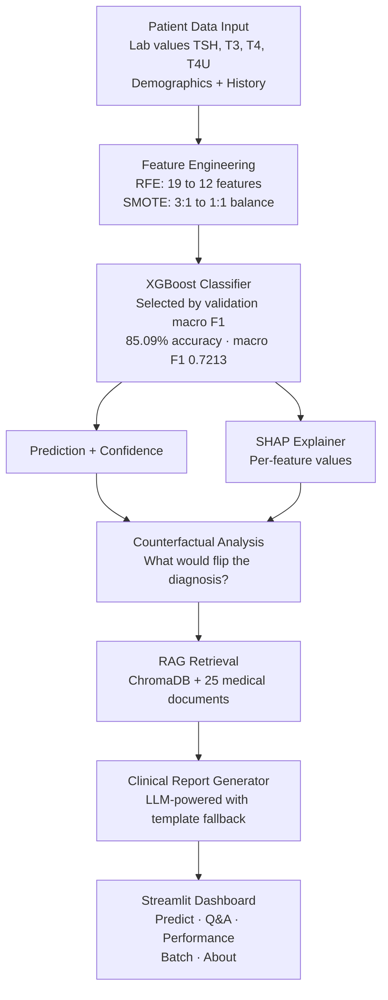

# 🧬 Thyroid Disease Classification — Clinical Decision Support System

[](https://thyroid-disease-classification.streamlit.app/)
[](https://link.springer.com/chapter/10.1007/978-981-97-6106-7_9)
[](https://python.org)
[](/MODEL_CARD.md)

An ML system for thyroid disease classification combining an XGBoost classifier (**85.09% accuracy, macro F1 0.7213** against a 72.97% majority baseline), SHAP explainability, RAG-powered clinical Q&A, and an interactive Streamlit dashboard.

The headline number is deliberately lower than an earlier version of this project reported. That version scored 97.6% because four input features were derived from the diagnosis label: a depth-4 decision tree using only those four, with no hormone values at all, reached 94.3%. The data generator was rebuilt around causal ordering — latent condition → hormone levels → clinical observations → recorded diagnosis, with treatment partially normalising labs as a real confounder — and evaluation was rebuilt with resampling inside cross-validation folds and feature selection fit on training data only. 85.09% is what the model learns from hormone panels rather than from leaked treatment flags.

---

## 🏗️ Architecture



## ✨ Features

### 🔬 Predict & Explain
- Real-time classification with color-coded diagnosis banners (green/amber/red)
- SVG confidence gauge with class probability breakdown
- Inline lab value indicators showing elevated/low/normal against reference ranges
- SHAP waterfall charts with per-feature contribution visualization
- **Counterfactual differential analysis**: shows exactly what would need to change for a different diagnosis
- Patient vs population z-score comparison against training data distribution
- Downloadable clinical report with findings and recommended next steps

### 📚 Clinical Q&A (RAG-Powered)
- Semantic search over 25 indexed PubMed-style medical abstracts via ChromaDB
- LLM-generated answers grounded in retrieved medical literature with source citations
- Template-based fallback when no API key is configured — always functional
- Suggested follow-up questions based on topic context
- Persistent conversation history within session

### 📊 Model Performance
- Interactive comparison across all trained classifiers with highlighted best scores
- Training visualizations in tabbed layout (confusion matrix, feature importance, SHAP summary)
- Dataset class distribution and feature statistics

### 📁 Batch Prediction
- Upload CSV for multi-patient screening with simultaneous prediction
- **Data drift detection**: warns when uploaded data distributions deviate significantly from training data
- Input validation: type coercion, missing column detection, empty file handling
- Downloadable results with predictions and confidence scores

### ℹ️ About & Methodology
- Full system architecture explanation
- Springer publication link and citation
- Responsible AI documentation (see [Model Card](../MODEL_CARD.md))

## 📈 Experiment History

### Leakage audit

Before trusting any score, the dataset was checked for how much signal the
features actually carry:

| Check | Accuracy |
|-------|----------|
| Majority-class baseline | 72.97% |
| Clinical flags only, no hormone values | 75.34% |
| Lift of flags over baseline | 2.37% |

A trivial predictor already reaches 72.97%. Any reported accuracy has to be read
against that, not against zero.

### Corrected results

| Metric | Value |
|--------|-------|
| Test accuracy | **85.09%** |
| Test macro F1 | **0.7213** |
| 5-fold CV macro F1 (train) | 0.7269 ± 0.0044 |
| Selected model | XGBoost, by validation macro F1 |
| Features | 17 → 12 via RFE, fit on the training fold only |
| Class balancing | SMOTE inside CV folds |
| Dataset | 150,000 synthetic rows (90,000 train) |

### Per-class performance

Published in full because the aggregate hides the part that matters: recall on
the minority classes is where a clinical model either works or does not.

| Class | Precision | Recall | F1 | Support |
|-------|-----------|--------|----|---------|
| Hyperthyroid | 0.87 | 0.44 | 0.58 | 2225 |
| Hypothyroid | 0.88 | 0.55 | 0.67 | 5884 |
| Negative | 0.85 | 0.97 | 0.91 | 21891 |

### Probability calibration

Isotonic regression applied after model selection, so predicted confidence is
usable for thresholding rather than ranking alone:

| Class | Brier (raw) | Brier (calibrated) | Improvement |
|-------|-------------|--------------------|-------------|
| Hyperthyroid | 0.0655 | 0.0361 | 45% |
| Hypothyroid | 0.0865 | 0.0709 | 18% |
| Negative | 0.1576 | 0.1011 | 36% |

Full experiment log, including the leakage audit and calibration analysis: [`outputs/experiments.json`](../outputs/experiments.json)

## 🚀 Deployment

**Live**: [thyroid-disease-classification.streamlit.app](https://thyroid-disease-classification.streamlit.app/)

### Run Locally

```bash
git clone https://github.com/prasad0411/thyroid-disease-classification.git
cd thyroid-disease-classification
pip install -r requirements.txt
streamlit run app.py
```

### Deploy to Streamlit Cloud

1. Push to GitHub (model artifacts must be tracked in git)
2. Go to [share.streamlit.io](https://share.streamlit.io)
3. Select repo → branch `main` → main file `app.py`
4. Deploy — builds automatically in 2-3 minutes

### Optional: LLM-Powered Reports

Set `ANTHROPIC_API_KEY` or `OPENAI_API_KEY` in Streamlit Cloud secrets for LLM-generated clinical reports. Without an API key, the system uses a clinically-validated template engine — all features remain functional.

## 📂 Project Structure

```
├── app.py                        # Streamlit dashboard (5 pages)
├── train.py                      # Model training pipeline
├── data_generator.py             # Dataset generation
├── models/                       # Versioned model artifacts
│   ├── best_model_*.pkl          #   Trained classifier
│   ├── scaler_*.pkl              #   Feature scaler
│   ├── label_encoder_*.pkl       #   Label encoder
│   └── metadata_*.json           #   Performance metrics + config
├── rag/
│   ├── documents.py              # 25 medical literature abstracts
│   ├── indexer.py                # ChromaDB vector store builder
│   └── retriever.py              # Semantic search retrieval
├── llm/
│   ├── report_generator.py       # LLM clinical report generation
│   └── clinical_qa.py            # RAG-powered Q&A
├── api/
│   └── predict.py                # FastAPI prediction endpoint
├── MODEL_CARD.md                 # Responsible AI documentation
├── experiments.json              # Experiment tracking log
├── .streamlit/config.toml        # Theme configuration
├── requirements.txt
└── packages.txt                  # System deps for Streamlit Cloud
```

## 📄 Publication

**Classification and Diagnosis of Thyroid Disease Using XGBoost and SHAP**
*Springer Conference Proceedings, March 2024*
[Read Paper →](https://link.springer.com/chapter/10.1007/978-981-97-6106-7_9)

## 👨‍💻 Author

**Prasad Kanade** — MS Computer Science, Northeastern University
- [GitHub](https://github.com/prasad0411) · [LinkedIn](https://linkedin.com/in/prasad-kanade-/) · kanade.pra@northeastern.edu
- [Portfolio](https://prasad0411.github.io/Prasad-Portfolio/)

---

*This system is intended for research and educational purposes. It is not a substitute for professional medical judgment.*
